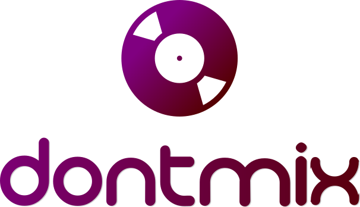

  </img>

Dontmix is a software capable of generating playlists from selected musics.
This is done with the power of the Spotify API. Another API that is consumed by the elm is written in Haskell, this API
allows to persist the data of a page, like dontpad.com.

# Dependencies

- Install Stack Plataform with `curl -sSL https://get.haskellstack.org/ | sh`
- Install elm. More information on `https://guide.elm-lang.org/install.html`
- Install elm-live with `npm install --global elm-live`

# How to use

- Clone project with `git clone https://github.com/fga-funcional/dontmix.git`
- On root page of the project, run `./run.sh`
- Access the app at `localhost:8080`

# Report

The report is [here](RELATORIO.md)