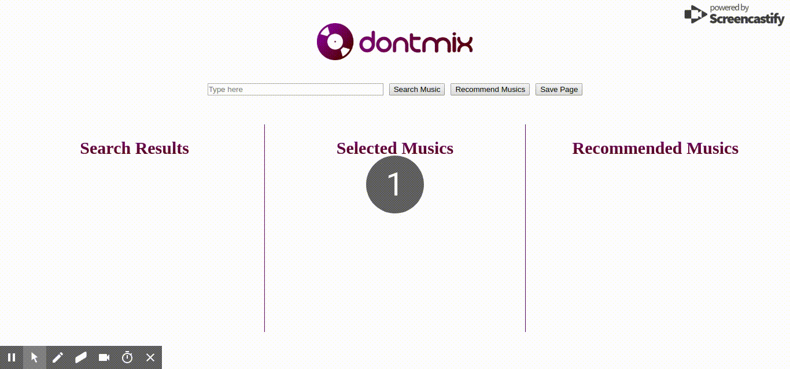

# Relatório do Projeto

## 1. Desenvolvimento técnico
### 1.1. Algum mecanismo de persistência?
Sim. O Back-end utiliza arquivos json para identificar as páginas existentes e seus conteúdos. Ele é capaz de criar novas páginas e atualizar as existentes.

### 1.2. Utilizou Recursos avançados da linguagem? (Elm ou Haskell)
No Elm foi utilizado `Browser.application` e isso permitiu trabalhar com URLs
e rotas. Esse recurso da linguagem auxiliou na integração com o Back-End.

Dentro do Back-End foi utilizado a biblioteca Lens. Essa biblioteca permite acessar e modificar valores dentro de estruturas de dados de maneira funcional, isto é, combinando funções.
Neste projeto foi utilizado para acessar campos em JSON da API do Spotify.

Outro recurso avançado utilizado no Haskell são as Monads Transformers, estas foram utilizadas dentro das ações do Scotty onde existiam chamadas para o módulo Database que eram do tipo IO porém a Monad era ActionM e então foi utilizado a função liftIO com o objetivo de transformar a 
saída da função de acesso ao banco para o tipo correto.

### 1.3. Rotas? Tasks e Subscribers em Elm?
Graças à arquitetura de Web APP (`Browser.Application`) do Front-end, foi possível utilizar um sistema de rotas, observando as alterações de URL e discriminando instâncias diferentes em cada uma delas. Isso quer dizer que cada rota é uma página única, com dados isolados e persistidos.

### 1.4. Criou tipos Union types?
Não foram necessários Union Types.

### 1.5. Instanciou alguma classe explicitamente em Haskell?
Não foi necessário instanciar nenhuma classe em Haskell.

## 2. Qualidade do Produto
### 2.1. Ignorando a aparência, implementa recursos básicos esperados?
Sim. É possível pesquisar músicas, selecioná-las, gerar playlists com base na sua seleção, além de persistir todos esses dados.

### 2.2. Implementa interações de forma eficiente?
Todas as interações são simples, como demonstradas no GIF à seguir:

### 2.3. Conseguiu polir a aplicação?
Sim. Tanto o Front-end quanto o Back-end estão bem modularizados e ambos estão seguindo padrões das linguagens (como a tipagem das funções). Ver seção 4.2.

### 2.4. Pronto para produção?
Sim. O software já pode ser implantado. Todavia, algumas melhorias poderiam ser adicionadas, como tocar o preview da playlist gerada.

## 3. Integração Front + Back
### 3.1. Front usa Back-end como mecanismo de persistência?
Sim. Ver tópico 1.1.

### 3.2. Conseguiu conectar os dois sistemas adequadamente?
Sim. Ambos os sistemas se comunicam corretamente via HTTP (métodos GET e POST). O problema de CORS foi evitado utilizando a ferramenta DEVD. Ver [README.md](README.md) e [run.sh](run.sh) para mais informações.

### 3.3. Consegue rodar mais de uma instância (discriminada por URL, por exemplo)
Sim. Ver tópico 1.3.

## 4. Método
### 4.1. Possui sistema de build?
Há um [sistema básico](run.sh) para rodar o projeto. Entretanto, as dependências listadas no README.md não são instaladas automaticamente.

### 4.2. Testes unitários e boas práticas?
Algumas boas práticas foram utilizadas no projeto. Foi feita
uma modularização do código tanto no Front-End quanto no Back-End.
Também as funções principais foram tipadas de forma a documentar
o código e facilitar a leitura.

O Front-End foi modularizado da seguinte forma:
- **Model:** Define os tipos bases utilizados no elm.
- **View:** Define o HTML e CSS utilizado no Front.
- **Msg:** Define as mensagens enviadas da View e comandos a serem executados.
- **SpotifyDecoder:** Implementa os decoders da API do Spotify
- **APIHandler:** Implementa os decoders e encoders da API Haskell

O Back-End foi modularizado da seguinte forma:
- **Main:** Módulo principal possui ações do Scotty e chamadas para API Spotify
- **Auth:** Módulo com objetivo de buscar access token.
- **Database:** Módulo responsável em tratar com arquivos JSON e fazer a  persistência dos dados.

Não há testes unitários. Apenas a compilação dos módulos do projeto confirma seu funcionamento.

### 4.3. Implantou em algum lugar?
Não.
